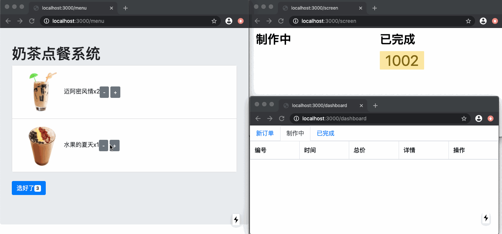

# nextAdmin

> 使用 next.js 构建的react应用，数据库用的是nedb。UI用的react-bootstrap和evergreen-ui。

首先，访问 http://localhost:3000/init 完成初始化

接下来，分别打开：

1、收银员界面
http://localhost:3000/menu

收银员通过这里下单

2、奶茶师界面
http://localhost:3000/dashboard 

奶茶师接单后，进行制作。

3、大屏幕界面
http://localhost:3000/screen 

顾客可以看到自己的订单号是否已经制作完毕

## 演示

## 作者
codetyphon

微信号 codetyphon

